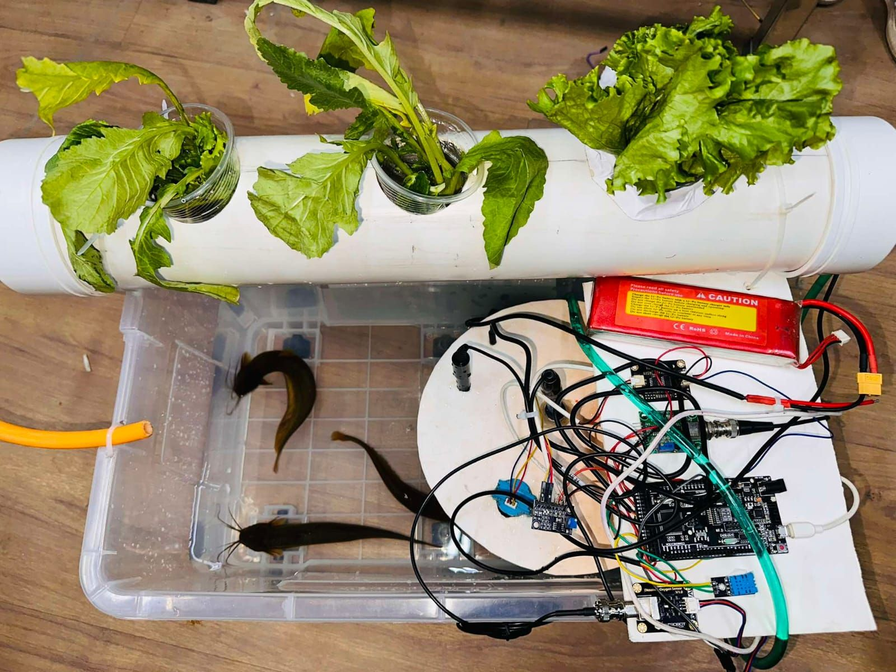

# 🌱 Integrated Hydroponics & Aquaponics Monitoring System



## 📌 Project Overview  
This project is part of **CSE216: Microprocessor Interfacing & Assembly Language**, integrating **Hydroponics & Aquaponics** with **IoT-based monitoring**. It optimizes plant growth and water quality using **microcontrollers and sensors**.

---

## 🚀 Key Features  
- ✅ **Aquaponics System**: Uses fish waste as plant nutrients.  
- ✅ **Hydroponics Setup**: Soil-less plant growth with controlled nutrients.  
- ✅ **IoT-Based Monitoring**: Real-time tracking of:
  - **pH Level**
  - **Temperature**
  - **Nutrient Levels**
  - **Dissolved Oxygen (DO)**
- ✅ **Microcontroller Integration**: Uses ESP32/Arduino for data collection.  
- ✅ **Sustainability Focused**: Reduces water wastage with a closed-loop system.

---

## 🛠 Tech Stack  
- **Hardware**: ESP32/Arduino, pH sensor, DO sensor, Temperature sensor  
- **Software**: C++, IoT Dashboard (ThinkSpeak, MQTT, WiFi)  
- **Libraries Used**:  
  - `DHT.h` → Temperature monitoring  
  - `WiFi.h` → IoT connectivity  
  - `MQTT.h` → Real-time data transmission  

---

## 📂 Project Structure  
```bash
📦 Integrated-Hydroponics-Aquaponics
├── 📁 Code                # Arduino source code
│   ├── arduino_marged_code.ino
│   ├── esp_thinkspeak_code.ino
├── 📁 Research_Paper      # Published research paper (PDF)
│   ├── Project_Paper.pdf
├── 📁 Images              # Project images
│   ├── hardware_setup.jpg
├── README.md             # Project documentation
